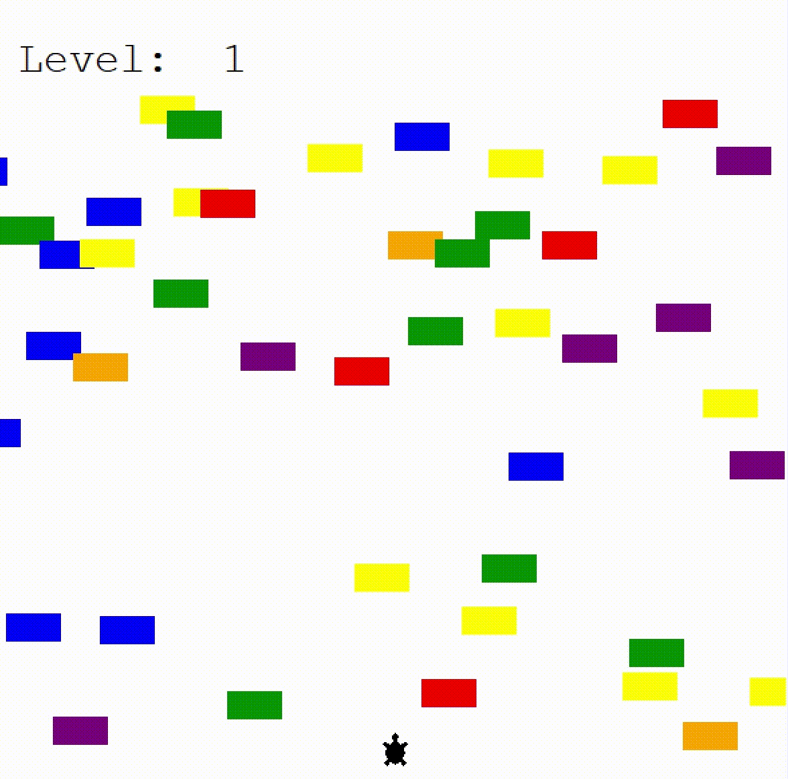

<h1>Day 23 of the 100 Days of Code: The Complete Python Pro Bootcamp</h1>

For the Day 23 challenge, I created a Turtle Crossing game where players have help a turtle cross to the end of the road and avoid incoming cars. This is a culmination of the teaching points that were shared in the tutorial, including the following but not limited to

<ul>
  <li>Object Oriented Programming, including Inheritance, Turtle/Screen Library</li>
  <li>Conditional Statements: If and While Loops</li>
  <li>Game Mechanism Planning - breaking down game into many different objects</li>
</ul>

> [!TIP]
> There's no need to code everything from scratch. In fact, many of these codes were derived and modified from the previous games that I created. Key is to understand how to break down the game into smaller parts and building different classes and functions for them. The flow and game mechanism are the largest variations and building a game is more about how you integrate the different components (which can be extracted from other game components) together.

<h2>Video of Turtle Crossing Game</h2>

  

<h2>Why am I doing this?</h2>

I have learned python before in school but I hope to revisit some of the python concepts that I may have forgotten and at the same time delve further into python, especially in the field of data science and visualisation.

<h2>You can join me too!</h2>

 Check out the 100 Days of Code: The Complete Python Pro Bootcamp udemy course through this <a href="https://www.udemy.com/course/100-days-of-code/">link</a>.

